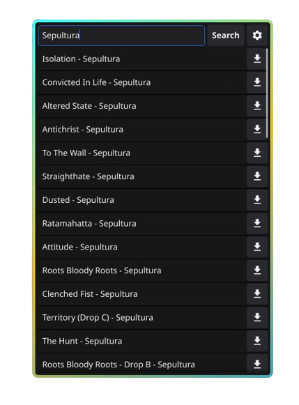

<sub>
<p align='center'></p>
</sub>
<h1 align="center">TabStop</h1>


**TabStop** is a lightweight and efficient application built with Go and Fyne. It allows you to search for songs or bands and download Guitar Pro tabs directly from [Songsterr](https://www.songsterr.com).

<sub>
<p align='center'></p>
</sub>


## Installation

### Use Binary Packages

Download the latest binary package from [releases](https://github.com/onurhanak/TabStop/releases) and run it.

### Run From Source Code

#### Steps

1. Clone the repository:
    ```sh
    git clone https://github.com/onurhanak/TabStop.git
    cd TabStop
    ```

2. Install dependencies:
    ```sh
    go mod tidy
    ```

3. Build and run the application:
    ```sh
    go run main.go
    ```

## Contributing

Contributions are welcome! Feel free to open an issue or submit a pull request.

## License

This project is licensed under the Unlicense license - see the [LICENSE](LICENSE) file for details.

## Disclaimer

Please note that I do not own any of the tabs provided by this script. All tabs are the property of Songsterr and their respective authors. This tool is designed to facilitate downloading tabs for personal use and should be used in compliance with Songsterr's terms of service and copyright laws.

**Important:**
- The use of this script and the downloaded tabs is entirely at your own discretion and risk.
- This script is provided for educational use only.
- I am not responsible for any misuse of the tabs or any copyright infringement caused by the users of this script.
- Users are encouraged to support the artists and the creators of the tabs by considering official sources or purchasing their music and tablatures.

By using this script, you acknowledge and agree to these terms.
